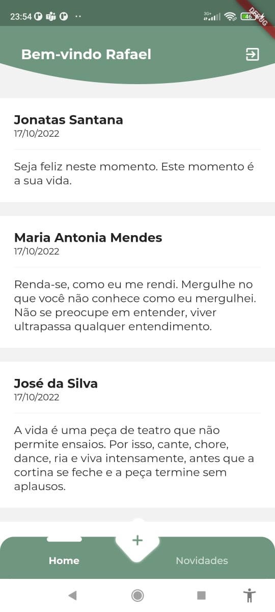
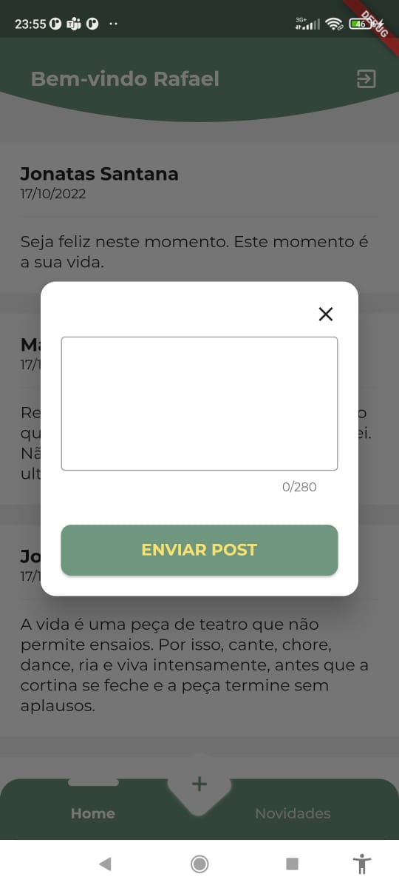

# Aplicativo Posts
Projeto destinado para estudo 

<h2>Screenshots</h2>

   <p align="center">
      
      
   </p>


<h2>Como instalar</h2>

   ```
   Baixe e configure o flutter:
   https://flutter.dev/docs/get-started/install

   - Clone o repositório:
   $ git clone https://github.com/rafaelmconceicao/Posts/

   - Instalar as dependências:
   $ flutter pub get

   - Execute o projeto:
   $ flutter run
   ```

---
